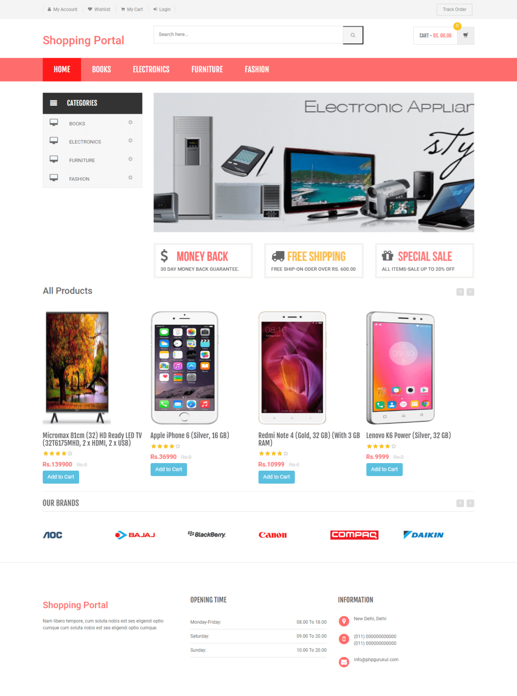
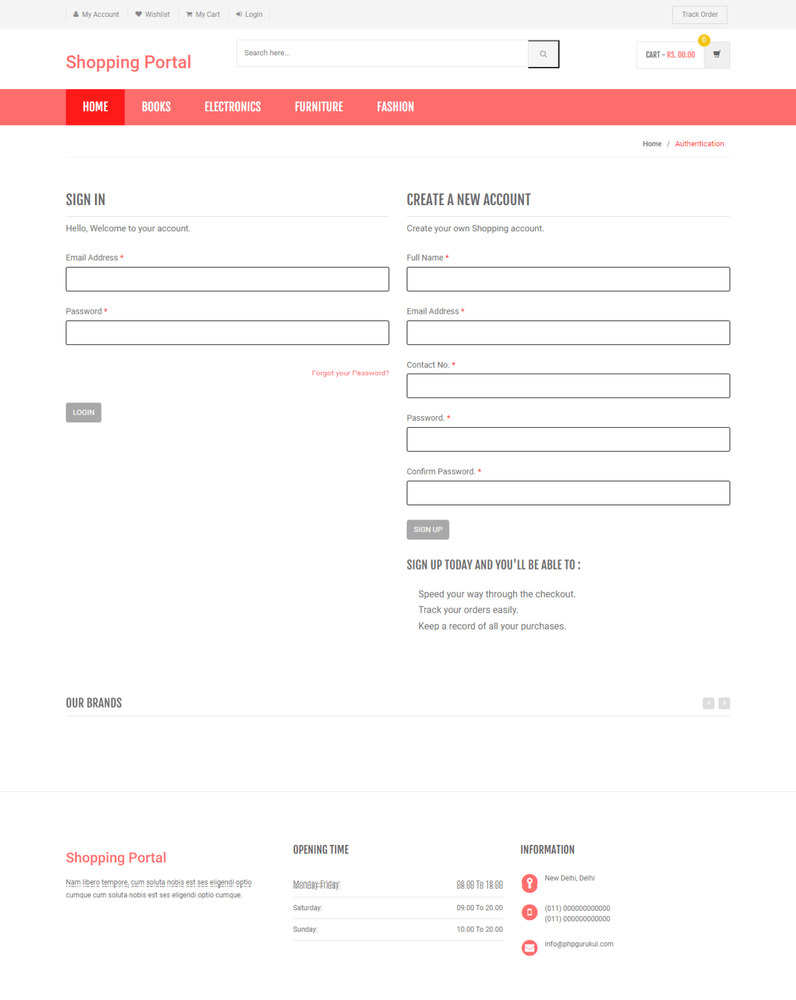
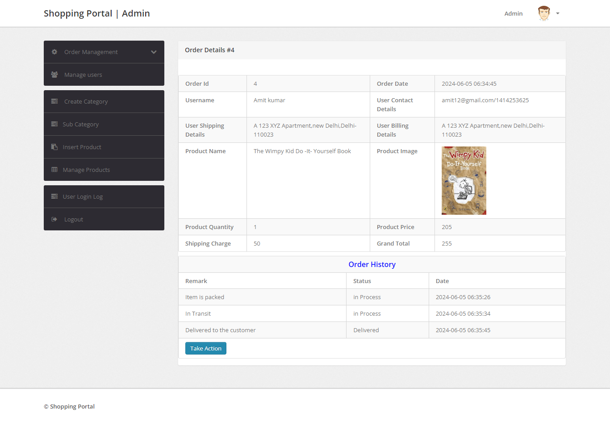
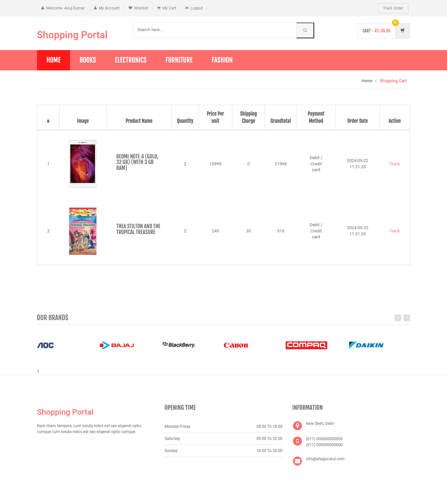

# 🛒 Online Shopping Portal 

This is a dynamic web-based **Online Shopping Portal** developed using PHP and MySQL. It allows users to browse products, add items to their cart or wishlist, and place orders. Admins can manage products, categories, and customer orders through a dedicated panel.

This project was developed as part of an **internship task** during the **second year of Diploma in Computer Engineering**.

---

## 📌 Project Overview

- **Project Title:** Online Shopping Portal  
- **Purpose:** Internship Project (Diploma in Computer Engineering - 2nd Year)  
- **Development Type:** Implementation of a complete shopping website  

---

## 🛠️ Technologies Used

- **Frontend:** HTML, CSS, JavaScript
- **Backend:** PHP  
- **Database:** MySQL  
- **Platform:** XAMPP  
- **Compatible Browsers:** Chrome, Firefox, Opera  

---

## 👤 User Features

- User Registration and Login  
- Change/Forgot Password  
- Profile Management  
- Product Browsing  
- Shopping Cart  
- Wishlist  
- Order History  

---

## 🛠️ Admin Features

- Product Management (Add, Update, Delete)  
- Order Management  
- User Management  
- Category and Sub-category Creation  
- View Order Details  

---

## 🧪 How to Run the Project

1. Download and unzip the project.  
2. Copy the project folder (e.g., `shopping/`) into your server root directory:
   - **XAMPP:** `htdocs`  
3. Open [phpMyAdmin](http://localhost/phpmyadmin)  
4. Create a new database named `shopping`  
5. Import the database file from the provided `.sql` file in the package  
6. Run the application in your browser:  
   - User Panel: [http://localhost/shopping](http://localhost/shopping)  
   - Admin Panel: [http://localhost/shopping/admin](http://localhost/shopping/admin)  

---

## 🔐 Login Credentials

### 🧑‍💼 Admin Login
- **Username:** admin  
- **Password:** Test@123

### 👤 User Login
- **Username:** johndeo@gmail.com  
- **Password:** Test@123  
(Users can also register their own accounts.)

---

## 📸 Screenshots

- Home Page   
- User Login / Signup   
- Product Listings   
- Order History   
- Add/Insert Product   
- Order Details   

---

## 📄 Disclaimer

This project was developed for learning purposes only as part of an internship task during the second year of diploma. The application is based on open-source concepts and customized for academic demonstration.

---

## 👩‍💻 Contributor

- **Anushka Salve** – Diploma in Computer Engineering (2nd Year)
